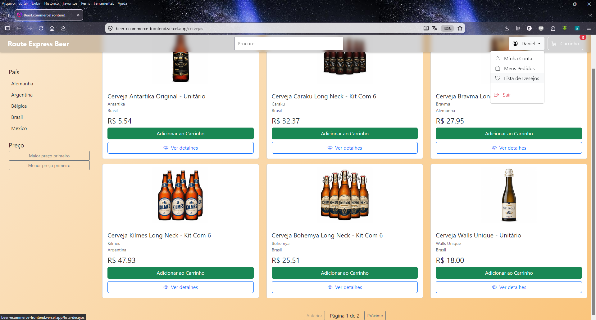
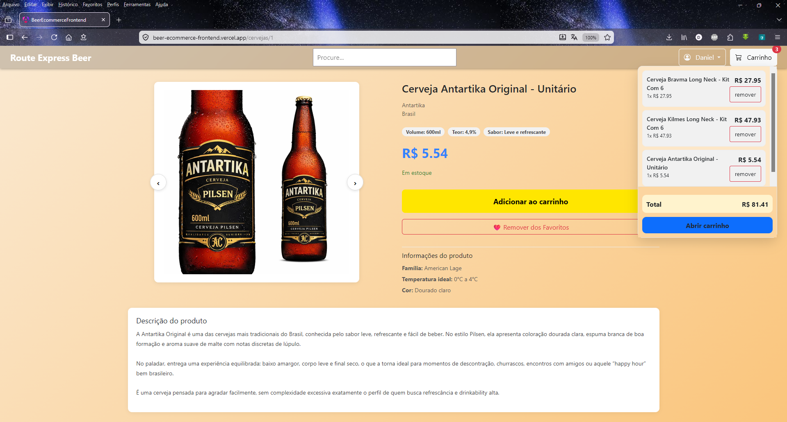
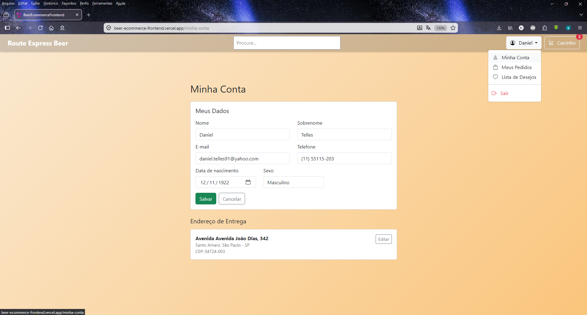
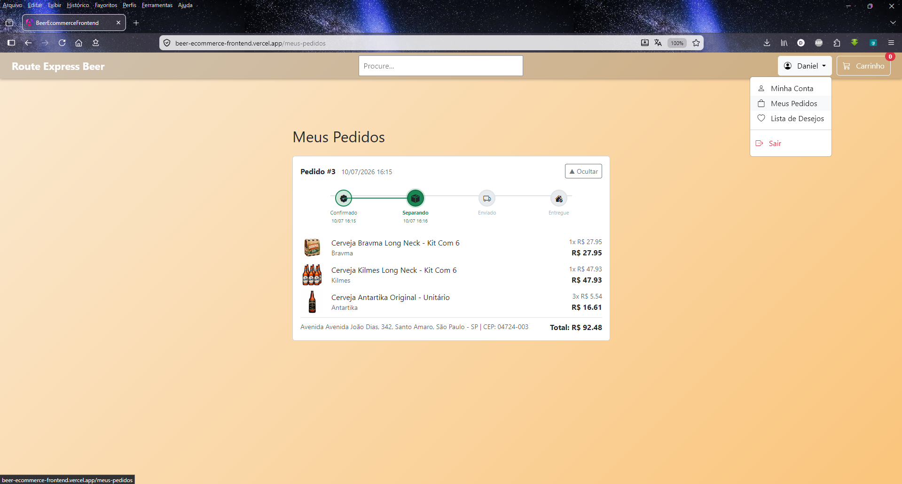
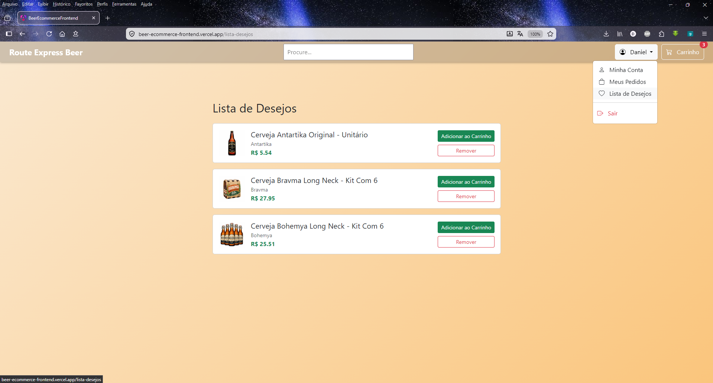
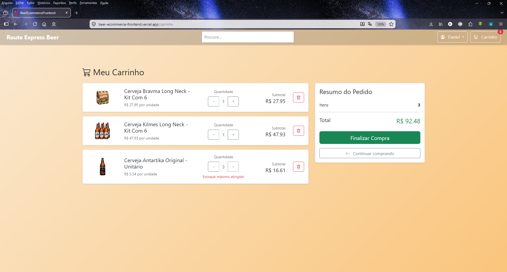
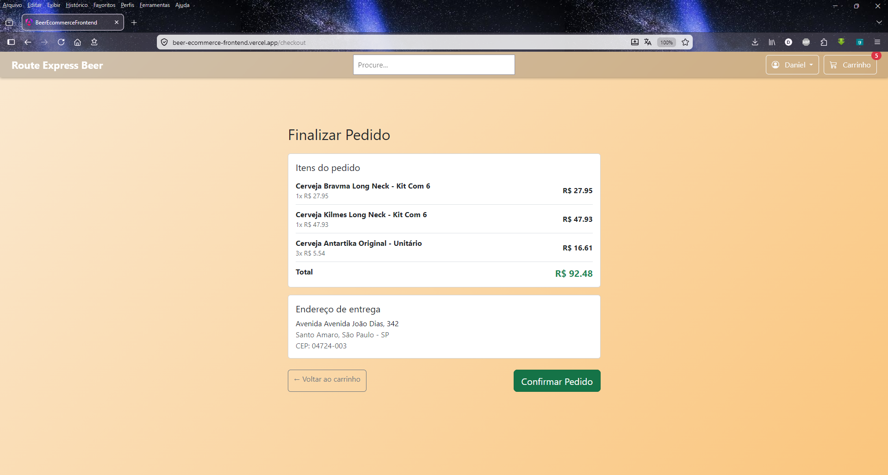
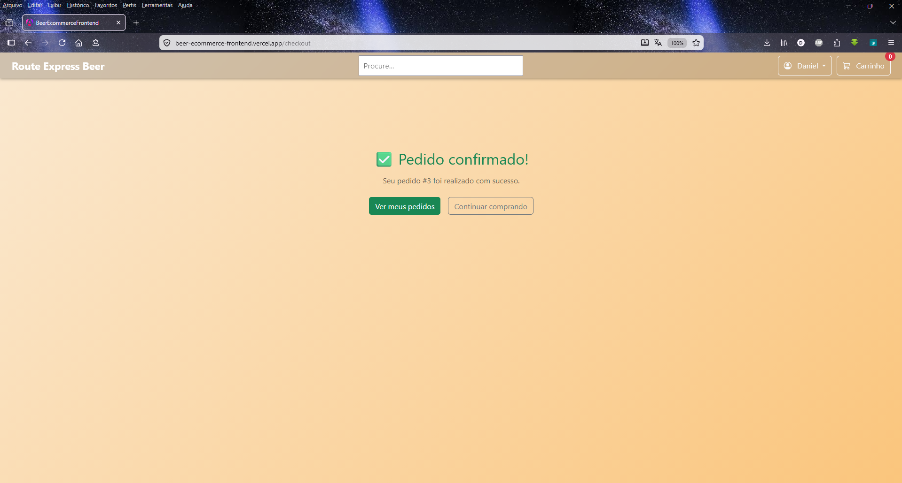

# Route Express - E-commerce Frontend

Customer facing frontend application for the Route Express e-commerce platform, built with Angular and integrated with a Spring Boot REST API.

## Project Background

This project is the frontend counterpart of the Route Express Back Office system.

The application consumes data from a Spring Boot backend through RESTful APIs, allowing customers to browse products, view detailed information, and interact with the online store.

The project was developed as a practical study of Angular and modern frontend architecture while integrating with a real backend application.


## Live Application

https://beer-ecommerce-platform.onrender.com/

Note: This application is hosted on Render. If it has been idle, the first request may take up to 3 minutes while the server wakes up.


## Screenshots
<p align="center">
  
  
  
  
  
  
  
  
</p>

## Demo Video

https://github.com/user-attachments/assets/3dcf73b2-45ca-4f05-a9b0-d0df862391cc


## Technologies

- Angular CLI version 22.0.2
- TypeScript
- HTML5
- CSS3
- Bootstrap
- REST API Integration
- JSON Data Exchange
- RxJS (reactive search, debounce, error handling)
- Angular Signals (zoneless change detection)
- Angular SSR (Server-Side Rendering)
- Reactive Forms
- JWT based authentication (HTTP Interceptor Route Guards)

## Current Features

Product Catalog

- Beer listing page with pagination.
- Product images loaded from the backend.
- Product information display: Name, Brewery, Country, Price.
- Sidebar filter by country (dynamically populated from available products).
- Price sorting (lowest first / highest first).
- Offcanvas filter panel on mobile (sidebar hidden by default, toggled via "Filtros" button).

Search

- Global search field located in the navbar (common e-commerce UX pattern).
- Debounced, reactive search (300ms) using RxJS debounceTime and distinctUntilChanged.
- Search term, country filter and price sort are all propagated via route query parameters (e.g. /cervejas?busca=ipa&pais=Brasil&ordenarPreco=asc), making the catalog state shareable, bookmarkable and persistent across navigation/refresh.

Product Details

- Dedicated product detail page.
- Route based navigation.
- Product information loaded dynamically from the backend API.
- Product image gallery support.

Shopping Cart

- Persistent cart for guest users (no login required), identified by a UUID generated on first visit and stored in localStorage.
- Mini cart dropdown in the navbar: shows items, quantities, subtotal and total. Opens on hover and on click (mobile friendly), and closes when clicking outside.
- Dedicated cart page (/carrinho):
  - Increase / decrease item quantity.
  - "+" button is automatically disabled when the cart quantity reaches the available stock level, with a message showing the maximum available units preventing the customer from ordering more than what is in stock.
  - Decreasing to zero automatically removes the item (matching the backend rule).
  - Remove item directly.
- Guest cart is automatically merged into the customer's cart on login.

Customer Registration & Email Confirmation

- Multi step registration form (/cadastro) 4 steps:
  1. CPF validated against the backend before advancing (instant feedback if already registered).
  2. Personal data name, e-mail (validated against the backend), phone, date of birth, password.
  3. Delivery address CEP field triggers an automatic lookup via the ViaCEP public API, pre-filling street, neighbourhood, city and state.
  4. Review summary of all entered data before submitting.
- After registration, a confirmation e-mail is sent with a one time token link.
- Confirmation page (/confirmar-email) validates the token and activates the account.
- The delivery address entered during registration is saved to localStorage and automatically created server side on the customer's first login (after e-mail confirmation), so no data is lost between registration and the first session.
- Support for the admin created customer flow: customers registered through the Back Office receive an e-mail with a link to set their first password (/definir-senha), which also confirms their e-mail in the same step.

Authentication

- Login page (/login) issuing a JWT from the backend on successful authentication.
- Token persisted in localStorage and automatically attached to every outgoing HTTP request via an HTTP Interceptor.
- Navbar reacts to authentication state: shows "Entrar" for guests. Shows the customer's name with a dropdown menu (Minha Conta, Meus Pedidos, Sair) once authenticated.
- Route guards: a guest guard keeps logged in users out of /login and /cadastro (redirecting to the catalog). An auth guard protects account and order pages, redirecting unauthenticated users to /login.
- On login, the guest cart is merged into the customer's server side cart.

Customer Account

- Minha Conta page (/minha-conta) protected by auth guard.
- Meus Dados section: view and edit personal data (name, e-mail, phone, date of birth, gender). Fields are read only by default. Clicking "Editar" enables them. Duplicate e-mail validation on save with a clear error message. Navbar name and e-mail update automatically if changed.
- Endereço section: view and edit delivery address with CEP auto fill via ViaCEP. "Add address" button only shown when no address exists yet (one address per customer model).


Wishlist

- Wishlist page (/lista-desejos) protected by auth guard, accessible from the user dropdown in the navbar.
- Heart button on the product detail page toggles the item in/out of the wishlist (filled heart = in wishlist, empty heart = not in list). Redirects to /login if not authenticated.
- Wishlist items link directly to the product detail page.
- "Add to Cart" button disabled for out of stock items in the wishlist.
- Wishlist state (set of favourite beer ids) is loaded as a Signal on login and on page refresh (ngOnInit guard), so the heart icon reflects the correct state across navigation and F5.


Password Recovery

- "Esqueceu sua senha?" link on the login page leads to /recuperar-senha.
- The customer enters their e-mail. The backend sends a reset link.
- /nova-senha validates the single-use token and allows setting a new password, then redirects to login.


Checkout & Orders

- Checkout page (/checkout) protected by auth guard:
  - Displays all cart items with quantities and subtotals.
  - Shows the registered delivery address.
  - "Confirm Order" button disabled if cart is empty or no address is set.
  - On confirmation, the backend validates stock availability, creates the order with data snapshots, debits stock, clears the cart, and sends an order confirmation e-mail.
  - Clear per item error messages if any product has insufficient stock.
- Order confirmation screen after successful checkout, with a link to Meus Pedidos.
- Meus Pedidos page (/meus-pedidos) protected by auth guard:
  - Full order history, newest first.
  - Each order shows status, date, delivery address snapshot, all items with images (from snapshot data), quantities, unit prices, subtotals and order total.
  - Cancelled orders show a badge with the cancellation timestamp.
  - Expandable detail section per order showing all items with images, quantities, unit prices, subtotals and order total.
  - Images load correctly even for products removed from the catalog (brewery id and filename captured at purchase time).


Backend Integration

- Communication with Spring Boot REST API.
- JSON based data exchange.
- Dynamic product loading from MySQL database through the backend layer.
- Centralized API base URL via Angular environments (environment.ts / environment.prod.ts).
- HTTP error handling (catchError) on catalog and cart requests, showing a user facing message instead of a blank screen when the backend is unreachable.

## Architecture

```text
┌────────────────────────────────────────────┐
│              Angular Frontend              │
│                                            │
│  ┌──────────┐  ┌──────────┐  ┌─────────┐   │
│  │Components│  │ Services │  │ Guards  │   │
│  └────┬─────┘  └────┬─────┘  └────┬────┘   │
│       │             │             │        │
│       └─────────────|─────────────┘        │
│              HTTP Interceptor              │
│         (attaches JWT automatically)       │
└──────────────────┬─────────────────────────┘
                   │ REST (JSON)
                   │ Authorization: Bearer <JWT>
                   |
┌──────────────────────────────────────────┐
│         Spring Boot REST API             │
│      (http://localhost:8080)             │
└──────────────────────────────────────────┘
                   │
                   |
┌──────────────────────────────────────────┐
│                 MySQL                    │
└──────────────────────────────────────────┘

External APIs consumed by the frontend:
┌──────────────────────────────────────────┐
│   ViaCEP (https://viacep.com.br)         │
│   CEP lookup for address auto-fill       │
└──────────────────────────────────────────┘
```

## Technical Notes

1. Zoneless change detection: this project was generated without zone.js, as recent Angular CLI versions default to a zoneless setup. After moving from the async pipe to manual .subscribe() calls (to support search and filtering), the view stopped updating automatically a typical zoneless change detection issue. Rather than masking it with ChangeDetectorRef.detectChanges(), the affected components were refactored to use Angular Signals (signal()), which integrate natively with zoneless change detection and trigger automatic, granular UI updates.

2. Cross component state via query params: the search input lives in the NavbarComponent, while the country filter and price sort live in a sidebar component (FiltroLateralComponent) none of them share a parent/child relationship with the catalog list. Their state is synchronized through route query parameters rather than a shared service, following the same pattern used by real world e-commerce platforms (filters reflected in the URL, shareable and bookmarkable).

3. Sorting across a collection relationship (backend): beer price lives on the related Estoque entity, not directly on Cerveja. Spring Data's automatic Sort/Pageable resolution can't navigate through a @OneToMany collection (PathException: Plural path refers to a collection). Solved with explicit JPQL queries ordering by the joined entity's field (ORDER BY e.preco).

4. SSR and browser only APIs: Angular SSR runs part of the application on Node.js before it reaches the browser, where localStorage and window don't exist. All access to localStorage is guarded by typeof window !== 'undefined', preventing ReferenceError during server side rendering. This applies to the cart session id, the auth token, and the pending address saved after registration.

5. Guest cart persistence and merge on login: the cart is tied to a randomly generated session UUID stored in localStorage and persisted server side. On login, the frontend calls a dedicated backend endpoint to merge that session's cart into the authenticated customer's cart. Verified across two different browsers acting as two separate devices.

6. SSR double execution on side effectful requests: components that trigger a one time, non idempotent backend call (such as /confirmar-email, which consumes a single use token) can hit a subtle SSR pitfall: the component runs once on the server and once again in the browser during hydration. The server side call consumed the token. The browser side call failed immediately after, overwriting the success state with an error. Fixed by skipping side effectful calls entirely when typeof window 'undefined'.

7. Centralized token handling via HTTP Interceptor: a functional HttpInterceptorFn reads the JWT from AuthService and adds the Authorization: Bearer header to every outgoing request automatically, keeping authentication concerns out of individual services.

8. crypto.randomUUID() fallback for non secure contexts: crypto.randomUUID() requires a secure context (HTTPS or localhost). When accessing the app via a local network IP (http://192.168.x.x), browsers block this API. A fallback using Date.now() and Math.random() is used when the native API is unavailable, ensuring the cart session UUID is always generated regardless of the access context.

9. Local network development setup: to allow testing from other devices on the same network, the Angular dev server is configured with host: "0.0.0.0" and the allowed hosts list in angular.json. The Spring Boot backend CORS configuration accepts requests from both localhost:4200 and the LAN IP.

10. Order image resolution from snapshots: order history images are resolved using the brewery id captured at purchase time (not the product id), since the backend serves images at /uploads/images/{cervejaria_id}/{filename}. Storing both the cerveja_id and cervejaria_id in the order snapshot ensures images load correctly even for products that no longer exist in the catalog.

## Project Status

This project is currently under active development.

Implemented:

- Product catalog with pagination.
- Product search (debounced, via navbar + query params).
- Country filter and price sorting (sidebar + mobile offcanvas).
- Product detail page.
- Shopping cart with real time stock limit enforcement.
- Guest session cart (persistent, UUID based).
- Cart merge into customer account on login.
- Multi step customer registration with CPF/email validation and ViaCEP address auto fill.
- E-mail confirmation flows (self registered and admin created customers)
- JWT based login/logout.
- HTTP Interceptor for automatic token attachment.
- Route guards (guest guard and auth guard).
- Customer account page with address management.
- Checkout with stock validation and order confirmation e-mail.
- Order history with product snapshots and images.
- Backend integration with centralized environment configuration.
- HTTP error handling on all requests.
- Responsive layout (mobile navbar, offcanvas filters).
- Wishlist (add/remove from product detail, dedicated page).
- Customer profile editing (name, email, phone, date of birth).
- Order status timeline with per step timestamps.
- Password recovery flow (request + reset).


Planned Features:

- Payment gateway integration
- Product reviews


## Author

Developed by Daniel Arantes Telles

## License

This project is licensed under the MIT License - see the LICENSE file for details.
